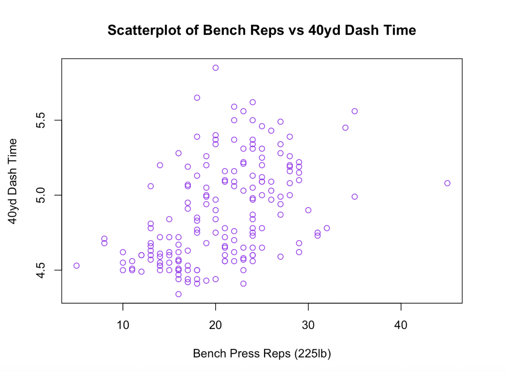

# Sports-Weightlifting-Speed-Performance-Analysis
This project explores the relationship between strength, speed, and explosiveness in competitive athletes using NFL Combine–style performance data. The analysis focuses on how upper-body strength (bench press repetitions), sprint speed (40-yard dash), and lower-body explosiveness (broad jump) interact across different athlete profiles.
# Sports Weightlifting & Speed Performance Analysis

## Overview
This project explores the relationship between **strength, speed, and explosiveness**
in competitive athletes using NFL Combine–style performance data.

The analysis focuses on how upper-body strength (bench press repetitions),
sprint speed (40-yard dash), and lower-body explosiveness (broad jump)
interact across different athlete profiles.

This project is designed to demonstrate **internship-ready data analysis skills**
using clean, reproducible workflows in **R**.

---

## Dataset
- **File:** `data/Sports_WeightliftingSpeed.csv`
- **Observations:** ~300 athletes
- **Key Variables:**
  - `Pos` – Player position
  - `X40yd` – 40-yard dash time (seconds)
  - `Bench` – Bench press repetitions (225 lbs)
  - `Broad Jump` – Broad jump distance (inches)
  - `BenchRep_Levels` – Strength tiers (low / med / high)
  - `40yd_Levels` – Speed tiers (low / med / high)

---

## Questions
1. How are player positions distributed across the dataset?
2. What does the distribution of 40-yard dash times look like?
3. How do strength and speed relate (quantitatively and categorically)?
4. Does explosiveness differ by bench press strength level?

---

## Methods
- Frequency and proportion tables
- Summary statistics (mean, median, SD, IQR)
- Histograms and boxplots
- Cross-tabulation of categorical variables
- Scatterplot analysis
- **Correlation and linear regression**
- **One-way ANOVA with post-hoc tests**

All analysis was conducted using **base R**.

---

## Key Insights (with visuals)

### 1) Speed distribution (40-yard dash)
40-yard dash times are slightly **right-skewed**, centered around ~4.7–4.8 seconds.

---

### 2) Strength–speed trade-off
Bench press repetitions show a **positive association** with 40-yard dash time
(more reps → slower sprint times).

---

### 3) Explosiveness by strength level
Athletes in lower bench press tiers exhibit **higher average broad jump distances**,
suggesting greater lower-body explosiveness.

---

## Repository Structure
